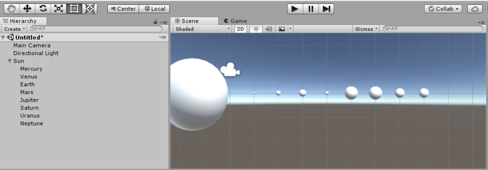
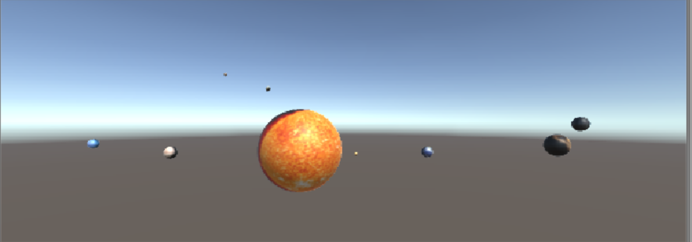
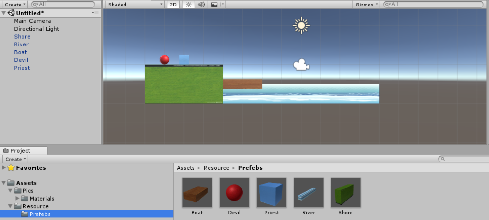
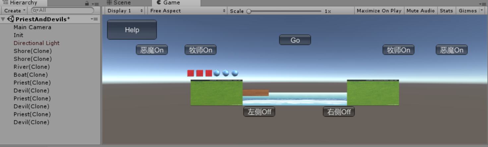

## 空间与运动 ##

### 游戏对象运动的本质是什么 ###
游戏对象的运动本质是游戏对象在每一帧发生了空间上的变化，这种变化包括位置上（position）的变化以及角度上（rotation）的变化。

### 用三种方法实现物体的抛物线运动 ###
1. 水平方向匀速向右，竖直方向加速向上。

<code>
  
    public class Move1 : MonoBehaviour {

	    // Use this for initialization
	    void Start () {
		
	    }

       public float speed = 1;
	
    	// Update is called once per frame
	    void Update () {
        this.transform.position += Vector3.right * Time.deltaTime * 4;
        this.transform.position += Vector3.up * Time.deltaTime * speed;
        speed++;
      }
    }
</code>

2. 新建一个Vector3变量v3，水平方向设置为向右匀速，竖直方向设置为向上加速。让物体每次变化一个v3的距离，从而实现抛物线运动。

<code>
  
    public class Move1 : MonoBehaviour {

	    // Use this for initialization
	    void Start () {
		
	    }

      public float speed = 1;
	
	    // Update is called once per frame
	    void Update () {

        Vector3 v3 = new Vector3(Time.deltaTime * 4, Time.deltaTime * speed);

        this.transform.position += v3;
        
        speed++;
      }
    }
</code>

3.新建一个Vector3变量v3，水平方向设置为向右匀速，竖直方向设置为向上加速。利用translate函数使物体每次update发生一个v3距离的位置变化。
<code>
  
    public class Move1 : MonoBehaviour {

	  // Use this for initialization
	  void Start () {
		
	  }

    public float speed = 1;
	
	  // Update is called once per frame
	  void Update () {

        Vector3 v3 = new Vector3(Time.deltaTime * 4, Time.deltaTime * speed);

        this.transform.Translate(v3);
        
        speed++;
     }
    }
</code>

### 写一个程序实现完整的太阳系。其它星球围绕太阳旋转的速度必须不一样，且不在同一个法平面上。 ###

游戏对象如下：

代码如下：
>>>

    public class Solar : MonoBehaviour {

	    // Use this for initialization
	    void Start () {
		
	    }

       public Transform Sun;
      public Transform Mercury;
      public Transform Venus;
      public Transform Earth;
      public Transform Mars;
      public Transform Saturn;
      public Transform Jupiter;
      public Transform Uranus;
      public Transform Neptune;

        // Update is called once per frame
        void Update () {

        // 自转
        GameObject.Find("Mercury").transform.Rotate(Vector3.up * Time.deltaTime * 10000);
        GameObject.Find("Venus").transform.Rotate(Vector3.up * Time.deltaTime * 10000);
        GameObject.Find("Earth").transform.Rotate(Vector3.up * Time.deltaTime * 10000);
        GameObject.Find("Mars").transform.Rotate(Vector3.up * Time.deltaTime * 10000);
        GameObject.Find("Saturn").transform.Rotate(Vector3.up * Time.deltaTime * 10000);
        GameObject.Find("Jupiter").transform.Rotate(Vector3.up * Time.deltaTime * 10000);
        GameObject.Find("Uranus").transform.Rotate(Vector3.up * Time.deltaTime * 10000);
        GameObject.Find("Neptune").transform.Rotate(Vector3.up * Time.deltaTime * 10000);

        // 公转
        Mercury.transform.RotateAround(Sun.position, new Vector3(0,1,0), 50*Time.deltaTime);
        Earth.transform.RotateAround(Sun.position, new Vector3(0.2f,1,0), 40 * Time.deltaTime);
        Venus.transform.RotateAround(Sun.position, new Vector3(0.5f, 1.1f, 0), 45 * Time.deltaTime);
        Mars.transform.RotateAround(Sun.position, new Vector3(0.4f, 1.2f, 0), 35 * Time.deltaTime);
        Saturn.transform.RotateAround(Sun.position, new Vector3(0.1f, 1, 0.1f), 30 * Time.deltaTime);
        Jupiter.transform.RotateAround(Sun.position, new Vector3(0, 1.1f, 0.2f), 25 * Time.deltaTime);
        Uranus.transform.RotateAround(Sun.position, new Vector3(0, 1, 0.4f), 20 * Time.deltaTime);
        Neptune.transform.RotateAround(Sun.position, new Vector3(0, 1.5f, 0), 15 * Time.deltaTime);

      }
    }
    
运行结果如下：

### 牧师与恶魔 ###

游戏对象：三个牧师，三个恶魔，两个河岸，一艘小船。

游戏动作表：

 |  事件         |       条件                           |
 |---------------|-------------------------------------|
 |开船           | 船靠岸，船上至少有一个人               |
 |牧师在开始岸上船| 船上没有人或者有一个人，开始岸有牧师    |
 |恶魔在开始岸上船| 船上没有人或者有一个人，开始岸有恶魔    |
 |牧师在结束岸上船| 船上没有人或者有一个人，结束岸有牧师    |
 |恶魔在结束岸上船| 船上没有人或者有一个人，结束岸有恶魔    |
 |左侧下船       | 船左侧有人                            |
 |右侧下船       | 船右侧有人                            |

实验预设：

运行结果：

