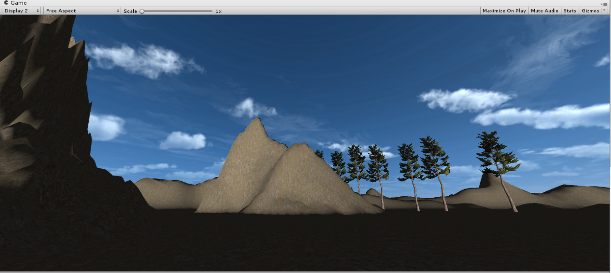
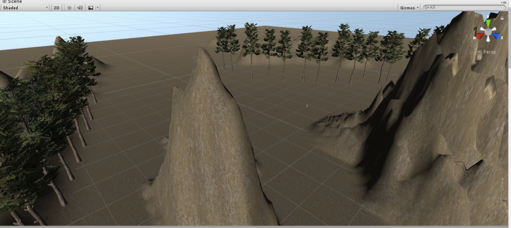

# 游戏对象与图形基础

## 操作与总结

### 使用Skybox构建游戏场景

### 总结
1. 首先从Asset store 中导入Skybox资源，在Window--Lighting--settings--Skybox Material中添加导入的天空图片。
1. 在场景中新建地形Terrain，用笔刷刷出想要的地形，在Paint Texture中选择Edit Textures，加入适合地形的图片，地形就会被上色。
1. 从Assets中导入Environment包，里面有Tree和Water等。点击Terrain的Paint trees--Edit trees--Add Tree添加树，然后就可以用笔刷在地形上种树，十分方便。
