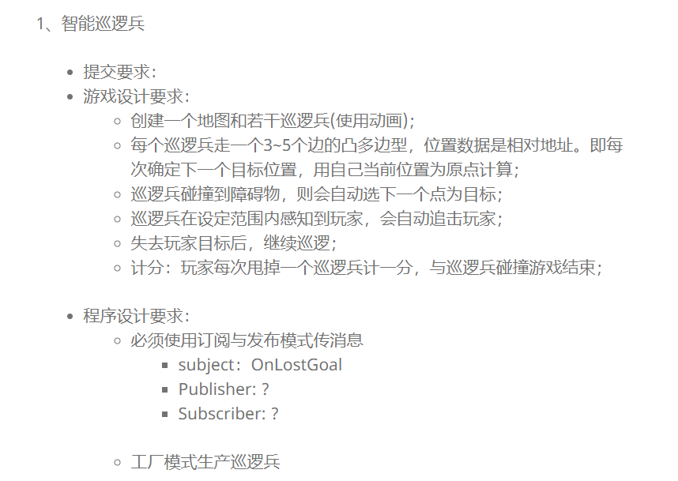

## Unity-3d Homework6 巡逻兵

### 游戏要求：

### 游戏实现：
#### 资源预置：
1. 巡逻兵Patrol，用红色Cube表示，具有刚体和collider属性
2. 玩家Hero，用红色Sphere表示，具有刚体和collider属性
3. 地图SceneModel，用Cube以及一些导入的资源组成。
#### 实现思路：
1. 根据地图的坐标将整个地图划分为6个区域，巡逻兵和玩家通过将自己的坐标与围栏的坐标对比，判断出自己所处的区域并获得一个index用来记录。
2. 在地图的六个区域分别放置一个巡逻兵，巡逻兵有4种行为：
  1. 巡逻。
  2. 当玩家Hero的index与自己相同，即处于同一区域的时候，追Hero。
  3. 当与墙或围栏发生碰撞时改变运动方向
  4. 当与玩家Hero发生碰撞时游戏结束。
3. 玩家Hero通过获取键盘输入来控制移动，因为有刚体和collider所以无法穿墙。移动的代码在UserInterface以及GameModel中实现了。
4. 六个巡逻兵是通过工厂生产的。在PatrolFactory中实现。工厂中预设了六个巡逻兵的初始位置，因此游戏刚开始时六个巡逻兵处于不同的区域。
5. 计分是通过判断Hero的index改变来完成的，每当Hero的index发生了一次改变，就表明Hero摆脱了一名巡逻兵进入了另一个区域，所以score加1。

#### 关于发布订阅模式
1. 订阅发布模式定义了一种一对多的依赖关系，让多个订阅者对象同时监听某一个主题对象。这个主题对象在自身状态变化时，会通知所有订阅者对象，使它们能够自动更新自己的状态。
2. 本游戏中，patrol为发布者，patrolBehavior为订阅者。当patrol发生碰撞时，便发出一个消息通知订阅者，订阅者收到消息后开始处理，判断patrol与谁发生碰撞，应该执行怎样的行为。

#### 视频地址
 https://www.bilibili.com/video/av23281670/
